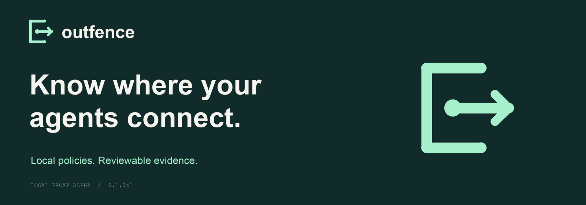

<p align="center"></p>

# Outfence

**Know where your agents connect.**

Outfence is a small, open source CLI that checks **proxy-routed outbound connections** against an allowlist and writes local HTML/JSON reports. Use it to explore an agent's network dependencies and compare observation with blocking.

**Alpha 0.1.0a1 · Apache-2.0 · Python 3.10+ · macOS/Linux · Zero runtime dependencies**

> This is a local development proxy, **not a network sandbox**. Programs can ignore proxy settings and connect directly. Outfence does not prevent all data leaks, inspect encrypted content, or certify data residency. See [security and coverage](SECURITY.md).

## Try it in one minute

Clone the repository and enter it:

```sh
git clone https://github.com/gsaccardi/outfence.git
cd outfence
```

Then run:

```sh
python3 -m outfence demo
```

No installation, Docker, API key, model, or internet connection is needed for this demo. It starts temporary localhost services and makes real HTTP requests through the proxy:

```text
model.example            HTTP 200
retrieval.example        HTTP 200
telemetry.example        HTTP 403
Fixture received 2 connections (destination-side evidence).
```

The CLI prints the paths of an offline HTML report and a JSON report under `runs/`. Open `report.html` in your browser. **Exit 2 is expected:** the example deliberately attempts a blocked destination. Each invocation creates a new report directory and shuts down its local servers.

Compare observation mode:

```sh
python3 -m outfence demo --mode observe
```

All three fixture requests succeed; the last is recorded as `would_block`. Observation still exits 2 for a policy violation.

## Install the command

From the repository root:

```sh
python3 -m venv .venv
source .venv/bin/activate
python -m pip install .
outfence --version
outfence demo
```

Installation may download build tooling; the application has no third-party runtime dependencies. The package is not published to PyPI yet—use the source checkout or a locally built wheel. The installed command works outside the checkout.

## Change a rule

```sh
outfence init demo-policy.json --demo
outfence check demo-policy.json
outfence demo --policy demo-policy.json
```

Add `{"host": "telemetry.example", "port": 80}` to the policy's `allow` array and rerun. All three demo requests should now succeed, with exit 0. Remove it to restore the blocked case.

A policy has an implicit default deny and exact hostname/port rules:

```json
{
  "version": 1,
  "allow": [
    {"host": "api.example.com", "port": 443}
  ]
}
```

`outfence init outfence.json` creates a **deny-all** policy. Hosts must be lowercase ASCII names (punycode for international names) or canonical IP addresses. Wildcards, trailing dots, duplicate rules, unknown fields, and invalid ports are rejected. Non-public upstream addresses remain blocked even if listed. Only the internal demo/test fixtures map synthetic names to localhost.

## Run a proxy-aware program

```sh
outfence run --policy outfence.json --timeout 60 -- python3 my_agent.py
```

The runner sets `HTTP_PROXY`, `HTTPS_PROXY`, and lowercase equivalents, and clears `NO_PROXY`. The program must honor them. Your command runs with your normal permissions, credentials, and API costs; Outfence is not an execution sandbox.

| Supported in this alpha | Outside coverage |
|---|---|
| HTTP GET forwarding | HTTP POST/PUT/etc. forwarding, custom HTTP headers and authentication |
| CONNECT tunnels used by HTTPS clients | TLS/content inspection, confirmation that tunnel bytes are actually TLS |
| Exact destination rules and public-address checks | Direct sockets, clients that ignore proxy settings, remote service downstream connections |
| Local policy snapshot and decision report | Tool/process attribution and complete traffic inventory |
| Workload timeout and ordinary child process cleanup | Host isolation, detached-process containment, Windows support |

HTTPS uses the client's normal end-to-end TLS connection. Plain HTTP forwarding intentionally preserves only Host and Connection request headers and Content-Type/Location response headers; it is intended for simple diagnostics. CONNECT idle timeout is 15 seconds; socket operations time out after 10 seconds. See [CLI reference](docs/CLI.md) for resource limits and outcomes.

## Run a real agent

Try the [local Ollama + GitHub walkthrough](docs/OLLAMA-WALKTHROUGH.md). A real Qwen model chooses two repository tools: Outfence permits metadata access and blocks the README until you change the policy. No API key is needed; an installed local model and internet access for the public tools are required. Model inference is deliberately outside proxy coverage.

```sh
python3 -m outfence run --policy examples/ollama-policy.json --timeout 300 -- python3 examples/ollama_agent.py
```

## Read the result

Reports contain destination host/port, decision, reason, connection status, timestamps, policy snapshot, and coverage limits. They contain no stored request paths, bodies, headers, environment values, or command output. Workload stdout/stderr remains visible in your terminal. Hostnames can still be sensitive; review reports before sharing.

| Exit | Meaning |
|---|---|
| 0 | Workload completed; no proxy violations or recorded proxy failures. Coverage is still proxy-only. |
| 2 | At least one blocked or would-block request |
| 3 | Setup/transport error, interruption, event loss, or unfinished request at shutdown |
| 4 | Workload failed without a higher-priority outcome |

Exit precedence: **3 → 2 → 4 → 0**. The workload's original exit code is recorded separately. An empty report means no proxy requests were observed; it does not prove there was no network activity.

Reports stay on your machine with owner-only file permissions. Use `--output NEW_DIRECTORY` to choose a location. Existing directories are refused before launching your command. See the [report format](docs/REPORT.md).

## Contribute

```sh
python -m pip install -r requirements-dev.txt
ruff check outfence tests examples/ollama_agent.py
ruff format --check outfence tests examples/ollama_agent.py
python -m unittest discover -s tests -v
python -m build --no-isolation
```

Tests use local fixtures and verify destination-side receipt. CI is configured for Python 3.10/3.13 on Linux and macOS, including installing the built wheel and running it outside the checkout. See [CONTRIBUTING.md](CONTRIBUTING.md).

Useful first contributions: sanitized agent-client compatibility cases, clearer report explanations, and feedback from people answering customer network-security questions.

## Where this is going

The next investigation is a supported Linux execution boundary, including whether to reuse GitHub's Agentic Workflow Firewall. We will prove direct-egress enforcement before claiming it. The [PRD](docs/PRD.md) describes that future product, not today's capabilities.

- [Changelog](CHANGELOG.md) · [Alpha release notes](docs/RELEASE.md)
- [Security](SECURITY.md) · [Architecture](docs/ARCHITECTURE.md)
- [Customer validation](docs/VALIDATION.md) · [Research](docs/RESEARCH.md)
- [Brand kit](brand/README.md)

Licensed under [Apache-2.0](LICENSE). GitHub: [gsaccardi/outfence](https://github.com/gsaccardi/outfence). Package-registry and domain names have not been reserved.
