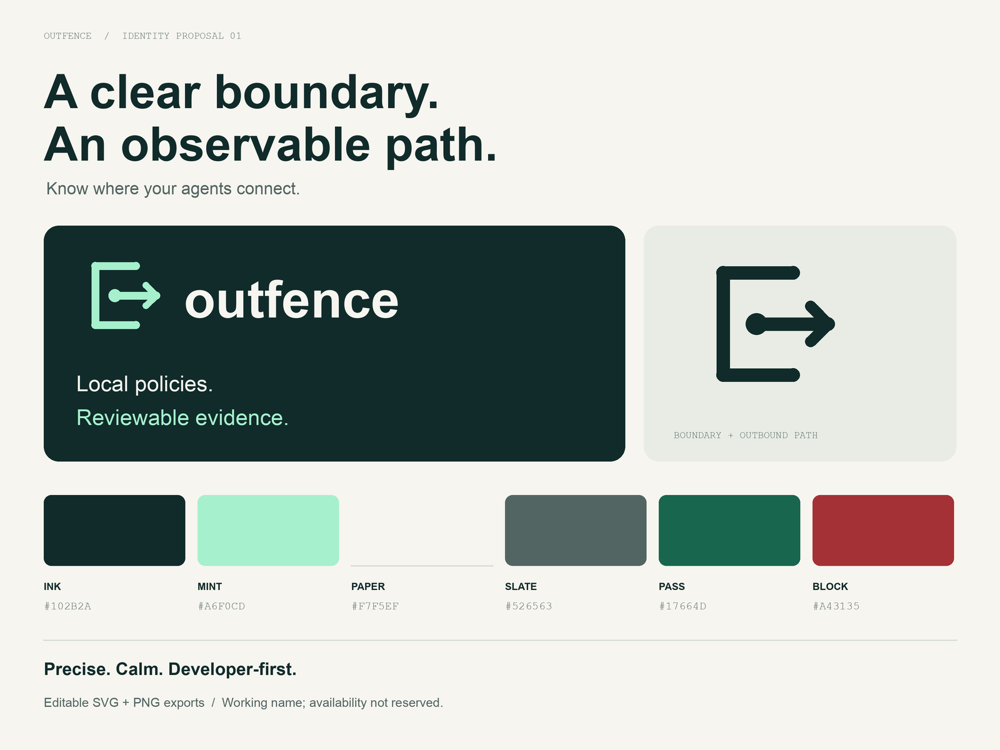

# Outfence brand guide

**Identity 02 · 12 September 2026**

## Name and positioning

**Outfence** combines outbound activity with a boundary. Pronounce it “OUT-fens.” Use Outfence in prose and `outfence` for the repository/CLI. The lowercase wordmark is intentional.

Primary line: **Know where your agents connect.**

Supporting line: **Local policies. Reviewable evidence.**

One sentence: “Outfence helps developers inspect proxy-routed agent connections and apply local destination policies.”

Name clearance and additional handles remain pending.

## Symbol

Two opposing circular segments form an open O. Small diagonal cuts and a slight offset make the negative space part of the symbol. The mark uses two filled vector paths with true circular arcs: no arrow, shield, outline, or decorative detail. It works in a single color at small sizes.

Minimum display size: 24 px symbol, 160 px complete wordmark. Keep clear space around the visible symbol equal to at least 15% of its width. Keep proportions intact. Use the monochrome mark on busy backgrounds. Do not add shields, gradients, glows, rotations, or extra outlines.

## Palette

| Token | Hex | Use |
|---|---|---|
| Ink | `#171917` | Primary text and dark backgrounds |
| Acid | `#D9F378` | Sparse supporting accent; never required to recognize the logo |
| Paper | `#FAFAF7` | Light canvas and text on ink |
| Slate | `#656B63` | Secondary text on paper |
| Line | `#D9DDD3` | Dividers and decorative boundaries |
| Success | `#17664D` | Allowed/passed label on paper |
| Warning | `#865500` | Observation or incomplete coverage label on paper |
| Danger | `#A43135` | Blocked/error label on paper |

Use ink text on acid. Acid is unsuitable for small text on paper. Keep the logo monochrome; reserve color for a small supporting detail. Pair every state color with a word or symbol; never communicate policy decisions through color alone. Divider color is decorative and must not be the only indicator of an interactive control.

## Typography and layout

Current artwork: Arial Regular with tightened spacing for the wordmark and large headings; small uppercase labels use wider spacing. These are system-font choices; no font files are distributed. SVG wordmarks retain editable text and may differ on systems without the font. Use PNGs for consistent GitHub display or outline the text before preparing professional print assets.

Web fallback stacks: `Arial, Helvetica, sans-serif` and `'Courier New', monospace`. Use a 4 px spacing base, generous margins, short headings, and clear labels. Use flat surfaces, generous whitespace, and a single clear visual hierarchy.

## Voice

Precise, calm, useful. Name the observed action and its scope.

Use: “Blocked telemetry.example:443 because it is outside your allowlist.”

Use: “Coverage incomplete: the collector stopped before the workload exited.”

Avoid: “Leak-proof,” “sovereignty certified,” “complete visibility,” or “production-ready” without supporting evidence. Do not substitute investor language for a concrete developer job.

## Assets

| Asset | Vector | Raster | Intended use |
|---|---|---|---|
| Ink mark | [SVG](assets/mark-ink.svg) | [PNG](assets/mark-ink.png) | Transparent icon on light backgrounds |
| White mark | [SVG](assets/mark-white.svg) | [PNG](assets/mark-white.png) | Transparent icon on dark backgrounds |
| Avatar | [SVG](assets/avatar.svg) | [PNG](assets/avatar.png) | 512 × 512 GitHub avatar |
| Light wordmark | [SVG](assets/wordmark-light.svg) | [PNG](assets/wordmark-light.png) | 760 × 180 transparent lockup |
| Dark wordmark | [SVG](assets/wordmark-dark.svg) | [PNG](assets/wordmark-dark.png) | 760 × 180 dark lockup |
| README banner | [SVG](assets/banner.svg) | [PNG](assets/banner.png) | 1600 × 560 banner |
| Social preview | [SVG](assets/social-preview.svg) | [PNG](assets/social-preview.png) | 1280 × 640 social card |
| Brand board | [SVG](assets/brand-board.svg) | [PNG](assets/brand-board.png) | 1600 × 1050 identity overview |

Machine-readable colors and typography: [tokens.json](tokens.json). Rebuild artwork with `python3 scripts/build_brand.py` from the repository root. Requires Pillow and the documented system fonts, or `OUTFENCE_FONT_DIR` pointing to equivalent font filenames.

The repository and artwork use Apache-2.0; the brand name remains provisional. The repository is github.com/gsaccardi/outfence. No trademark, domain, or package-registry name has been reserved.
